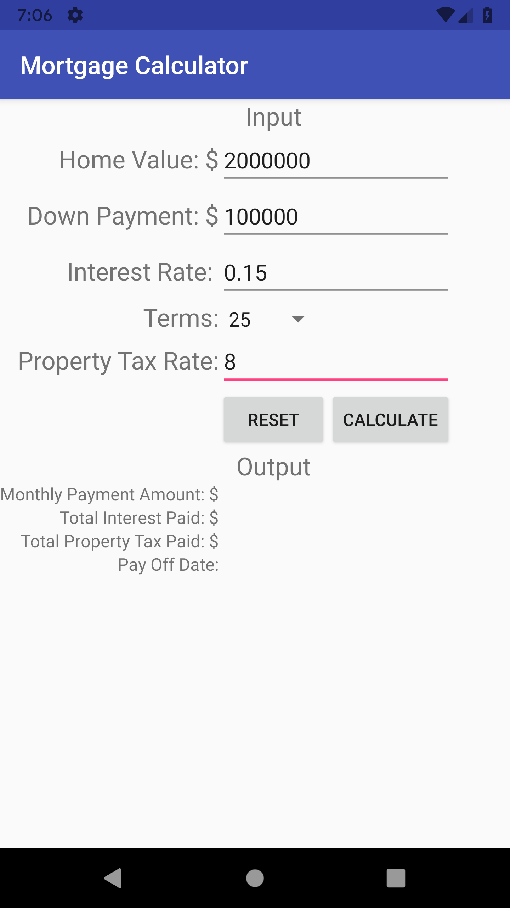

# CMPE137 Mobile Software Engineering - MortgageCalculator
This repository contains the MortgageCalculator app from CMPE137, the mobile software engineering course from SJSU. This app is an 
introductory assignment to learn how to set up a simple UI in Android Studios.

## Overview
MortgageCalculator allows the user to input their information and the app calculates their mortgage.

